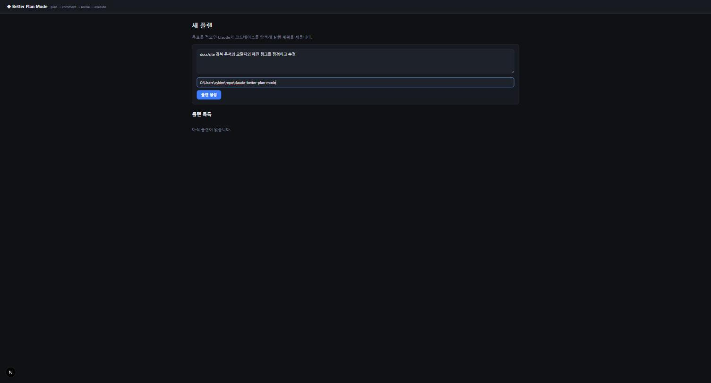
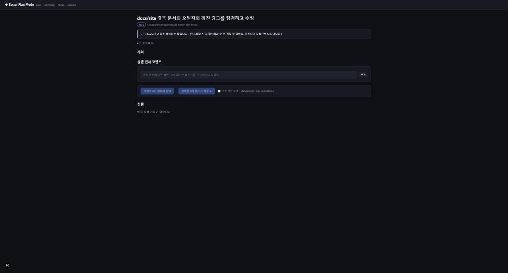

# First plan



### 홈에서 목표 입력

`http://localhost:3000` 첫 화면의 텍스트박스에 목표를 적습니다.

> 예: "로그인 기능에 OAuth를 추가하고 테스트까지 작성"

<figure><figcaption>홈 화면: 목표 입력 + 플랜 목록</figcaption></figure>


### 대상 프로젝트 선택

드롭다운에서 `config/projects.json`에 등록한 프로젝트를 고릅니다. 이 설정에서 기본 브랜치·직푸시 허용 여부·Unity 검증 경로를 가져오기 때문에, 프로젝트를 고른 플랜은 착수할 때 **PR 생성 / 기본 브랜치 직푸시**를 선택할 수 있습니다.

등록되지 않은 리포라면 **직접 경로 입력**을 골라 절대경로를 적습니다 (예: `C:\Users\me\repo\my-project`). 이 경우 착수는 그 경로에서 실행만 하고 커밋·push는 하지 않습니다.


### 계획 모델·추론 레벨 (선택)

계획을 세우는 에이전트에 쓸 모델과 추론 레벨을 고를 수 있습니다. 비워 두면 기본값을 씁니다. 이 선택은 플랜에 저장돼 코멘트 반영(revise) 때도 그대로 쓰입니다.


### 플랜 생성

**플랜 생성**을 누르면 즉시 보드로 이동하고, 백그라운드에서 Claude가 계획을 만듭니다. 코드베이스 크기에 따라 수 분 걸릴 수 있으며, 완료되면 보드에 자동으로 나타납니다(3초 폴링).

<figure><figcaption>생성 중 — 완료되면 자동 갱신</figcaption></figure>


### 결과 확인

overview, phase별 태스크 카드, 수정 이력이 보이면 성공입니다. 이제 [보드 사용법](../guide/board.md)으로.




생성이 실패하면 보드 상단에 오류가 표시됩니다. 대부분 `claude` CLI 미로그인 또는 경로 오타입니다.


다음: [Board tour](../guide/board.md) · [Comments & revise](../guide/comments.md)
