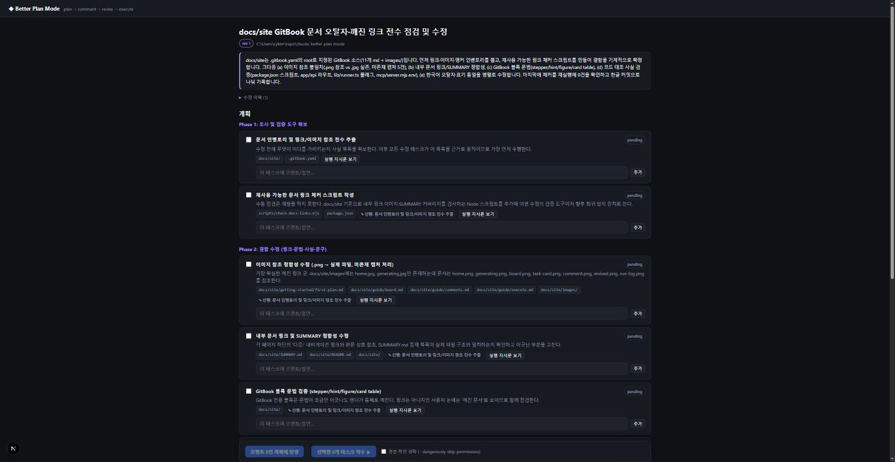
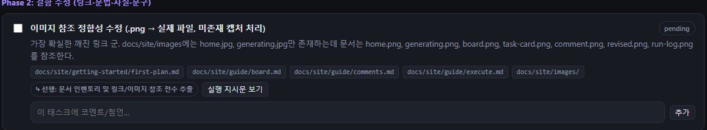

# Board tour

플랜 하나가 보드 한 장입니다 (`/plan/<id>`).

<figure><figcaption>플랜 보드</figcaption></figure>

## 화면 구성

| 영역 | 내용 |
|------|------|
| 헤더 | 플랜 제목, `rev N` 배지, 대상 프로젝트 경로 |
| Overview | 계획 전반 요약 |
| 수정 이력 | revision별 변경 요약 (접기/펼치기) |
| 계획 | phase 제목 아래 태스크 카드 나열 |
| 플랜 전체 코멘트 | 계획 전반에 대한 첨언 |
| 액션바 | 코멘트 반영 · 선택 착수 · 권한 체크박스 |
| 실행 | 최근 run 패널과 실시간 로그 |
| 진행 현황 (오른쪽) | 착수한 run의 진행률 막대 · 태스크별 완료 여부 · 경과 시간 ([Partial execution](execute.md)) |

## 태스크 카드

<figure><figcaption>태스크 카드 — 체크박스, 상태, 파일 칩, 코멘트 입력</figcaption></figure>

| 요소 | 의미 |
|------|------|
| 체크박스 | 착수 대상 선택 (`pending`/`failed`만 가능) |
| 상태 배지 | `pending` `queued` `running` `done` `failed` `skipped` |
| 파일 칩 | 관련 파일/영역 힌트 |
| ⤷ 선행 | 의존하는 선행 태스크 |
| 실행 지시문 보기 | 착수 시 `claude -p`에 전달될 상세 prompt 미리보기 |
| 코멘트 입력 | 이 태스크에 대한 첨언 ([Comments & revise](comments.md)) |


`done`/`failed` 상태는 revise를 거쳐도 보존됩니다 — 코멘트 반영이 완료된 작업을 되돌리지 않습니다.


다음: [Comments & revise](comments.md) · [Partial execution](execute.md)
