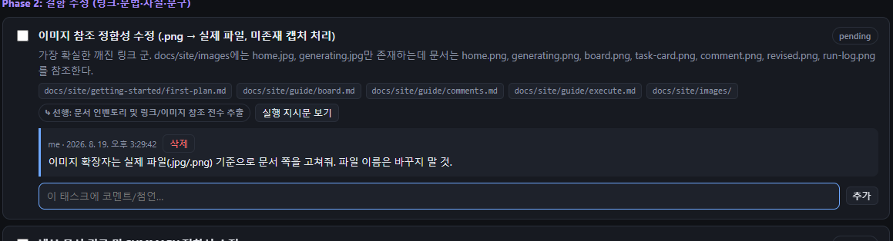
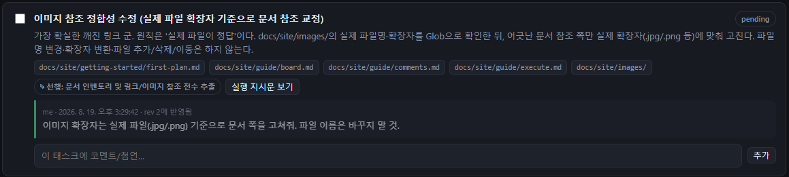

# Comments & revise



### 코멘트 달기

두 종류가 있습니다.

| 종류 | 위치 | 예 |
|------|------|----|
| 태스크 코멘트 | 각 태스크 카드 아래 입력창 | "이 태스크는 기존 유틸 재사용해" |
| 플랜 전체 코멘트 | "플랜 전체 코멘트" 카드 | "테스트 태스크를 각 단계마다 넣어줘" |

Enter 또는 **추가**로 등록합니다. 반영 전이면 삭제할 수 있습니다.

<figure><figcaption>태스크 코멘트 입력</figcaption></figure>


### 반영

액션바의 **코멘트 N건 계획에 반영**을 누르면 미해결 코멘트 전부를 Claude가 읽고 계획을 수정합니다.


### 결과 확인

- revision이 1 올라가고 수정 이력에 변경 요약이 남습니다.
- 반영된 코멘트는 `rev N에 반영됨` 표시와 함께 resolved 처리됩니다.
- 기존 task id와 `done`/`failed` 상태는 유지됩니다.

<figure><figcaption>반영 후 — revision 증가, 코멘트 resolved</figcaption></figure>




반영은 한 번에 미해결 코멘트 전체를 대상으로 합니다. 코멘트를 모아뒀다가 한 번에 반영하는 편이 revision 이력이 깔끔합니다.


다음: [Partial execution](execute.md)
