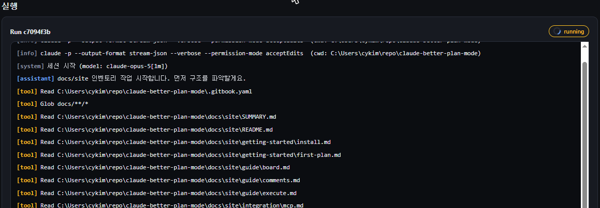

# Partial execution



### 태스크 선택

실행할 태스크의 체크박스를 고릅니다. `pending`/`failed`만 선택 가능하고, 선행 태스크가 있으면 순서를 참고하세요.


### 착수

**선택한 N개 태스크 착수 ▶**를 누르면 선택 태스크들의 실행 지시문을 조립해 대상 프로젝트(workdir)에서 `claude -p`(headless)가 수행합니다.

<figure><figcaption>실행 패널 — 실시간 로그 스트리밍</figcaption></figure>


### 결과 반영

run이 끝나면 태스크 상태가 `done`/`failed`로 바뀝니다. 실패한 태스크는 다시 체크해 재착수하거나, 코멘트로 계획을 고친 뒤 재시도합니다.



## 권한 모드

| 모드 | 플래그 | 언제 |
|------|--------|------|
| 기본 | `--permission-mode acceptEdits` | 파일 편집 자동 허용 (기본값) |
| 생략 | `--dangerously-skip-permissions` | 액션바 체크박스로 전환 |


`--dangerously-skip-permissions`는 모든 권한 확인을 건너뜁니다. **신뢰하는 리포에서만** 쓰세요.



run 로그는 서버 프로세스 메모리에만 있습니다. 서버를 재시작하면 과거 로그는 `expired`로 표시됩니다 (태스크 상태는 유지).


다음: [MCP on-demand](../integration/mcp.md) · [REST API](../reference/api.md)
